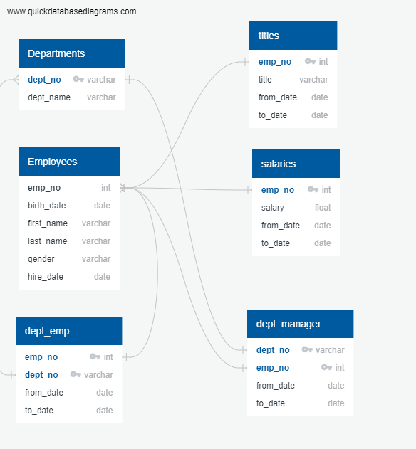

# Pewlett-Hackard-Analysis

## Overview of the analysis: 
Pewlett-Hackard is facing a large wave of vacancies due to mass retirements.  This analysis is to research who will be retiring in the next few years and how many positions will need filled so that a mentorship program can be implemented minimize the impact.  In order to perform this analysis six CSV files have been supplied to be loaded into the PH-EmployeeDB:

- employees.csv
- departments.csv
- dept_emp.csv
- dept_manager.csv
- salaries.csv
- titles.csv

**_Figure 1: PH EmployeeDB Schema_**

## Results: 
Provide a bulleted list with four major points from the two analysis deliverables. Use images as support where needed.

## Summary: 
Provide high-level responses to the following questions, then provide two additional queries or tables that may provide more insight into the upcoming "silver tsunami."
How many roles will need to be filled as the "silver tsunami" begins to make an impact?
Are there enough qualified, retirement-ready employees in the departments to mentor the next generation of Pewlett Hackard employees?
